Overview
---------------------------------------------

This project's infrastructure, partially automated using AWS CDK, includes S3 buckets, Lambda functions, 
API Gateway, and CloudWatch log groups, with a focus on streamlining deployment. 
Not all components are deployed via CDK; 
some, like certain AWS Glue jobs and an RDS Aurora MySQL Serverless database, 
were configured manually through the AWS console, showcasing a hybrid approach to infrastructure setup. 

  

## AWS Cloud Development Kit (CDK) Configuration

### Resources Created

1.  **S3 Bucket**: Stores data and is configured with auto-deletion policies for cleanup.
    
2.  **IAM Role**: Grants necessary permissions for Lambda functions to access AWS services like S3, RDS Data API, and Secrets Manager.
    
3.  **Lambda Functions**:
    
    *   **s3\_to\_rds\_lambda\_function**: Processes data from S3 and inserts it into an Aurora RDS instance.
        
    *   **insert\_data\_lambda\_function**: Handles data insertion into RDS from API Gateway requests.
        
    *   Both functions are equipped with custom and SDK lambda layers for additional functionalities and logging.
        
4.  **API Gateway**: Provides a RESTful endpoint **insert\_data** for data operations, secured with API keys for authorized access.
    
5.  **CloudWatch Log Groups**: Collects logs from Lambda executions for monitoring and debugging purposes.
    

### Security and Access Control

*   The IAM role includes policies for comprehensive access to the necessary AWS services.
    
*   API Gateway requests must include a valid API key generated during the deployment.

AWS Glue Jobs (an alternative for the traditional snapshot backup methods)
---------------------------

This project incorporates two critical AWS Glue jobs, facilitating the movement of data between AWS services, enhancing the project's data processing capabilities.

### Job 1: RDSToS3

This job is designed to extract data from the RDS Aurora MySQL Serverless database and store it in designated S3 buckets. The job iterates over specified database tables, executing SQL queries to fetch the data. The results are then formatted into Avro format and saved into S3, structured by the corresponding table names.

### Job 2: S3ToRDS

This job focuses on importing data from S3 back into the RDS Aurora MySQL Serverless database. It reads Avro formatted files from S3, representing data from different tables like departments, employees, and jobs. Each data set is then inserted into its respective table in the database, ensuring that the data flow is bidirectional and versatile.

Both jobs are dynamically configured to handle multiple tables and employ a combination of AWS Glue's dynamic frames, Spark SQL queries, and JDBC connections.

## Database Schema Overview

The schema for the employee management system consists of three main tables designed to store information about departments, jobs, and employees.

### Departments Table Structure

| Column Name     | Data Type        | Constraints                  |
|-----------------|------------------|------------------------------|
| id              | INT              | NOT NULL, AUTO_INCREMENT, PRIMARY KEY |
| department_name | VARCHAR(255)     | NOT NULL                     |

### Jobs Table Structure

| Column Name | Data Type    | Constraints                  |
|-------------|--------------|------------------------------|
| id          | INT          | NOT NULL, AUTO_INCREMENT, PRIMARY KEY |
| job_name    | VARCHAR(255) | NOT NULL                     |

### Employees Table Structure

| Column Name   | Data Type    | Constraints                  |
|---------------|--------------|------------------------------|
| id            | INT          | NOT NULL, AUTO_INCREMENT, PRIMARY KEY |
| name          | VARCHAR(255) | NOT NULL                     |
| datetime      | VARCHAR(255) | NOT NULL                     |
| department_id | INT          |                              |
| job_id        | INT          |                              |

